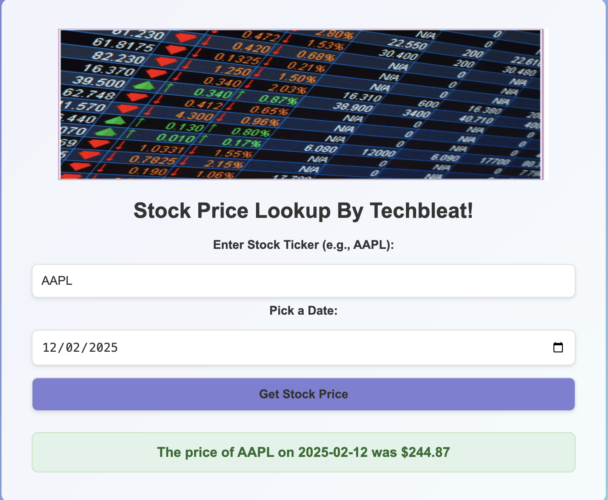

# Stock Price Cache Application  [ By Techbleat ]




This project consists of a **FastAPI** service that fetches stock prices from a **Spring Boot** application, which caches the data in **Redis**. The services are orchestrated using **Docker Compose**. Additionally, there is a **web interface** (`index.html`) that allows users to interact with the application through a simple UI.

## Services Overview

1. **FastAPI** (`stock-api`): This service exposes an API that allows clients to get stock prices by providing a ticker symbol and date. It first checks the cache (Redis) via the Spring Boot application, and if the data is not available, it fetches the data externally (mocked in this case) and stores it in Redis.
   
2. **Spring Boot** (`stock-cache`): This service provides caching capabilities, storing and retrieving stock prices in Redis.

3. **Redis** (`redis`): The cache store where stock prices are stored temporarily.

4. **Web Frontend** (`index.html`): A simple web page that allows users to input a stock ticker and date to retrieve stock price information and see the result.

## Prerequisites

- Docker
- Docker Compose
- Web Browser (for testing the frontend)

Ensure you have Docker and Docker Compose installed. You can check if Docker is installed by running:

```bash
docker --version
docker-compose --version
```


## Setup
### Clone the Repo

```bash
git clone https://github.com/your-repo-name/stock-price-cache.git
cd stock-price-cache

```

## Build and Start the Services
### Make sure you are in the root directory of the project, then build and start the services using Docker Compose:

```bash
docker-compose up -d --build --force-recreate
```

## Verify the Services Are Running
### After the services are up and running, you can check if they are operating as expected.

1. **FastAPI** is running on http://localhost:8000.
2. **Spring Boot** is running on http://localhost:8080.
3. **Redis** is running on localhost:6379.
4. **Web Frontend** is available on http://localhost.
